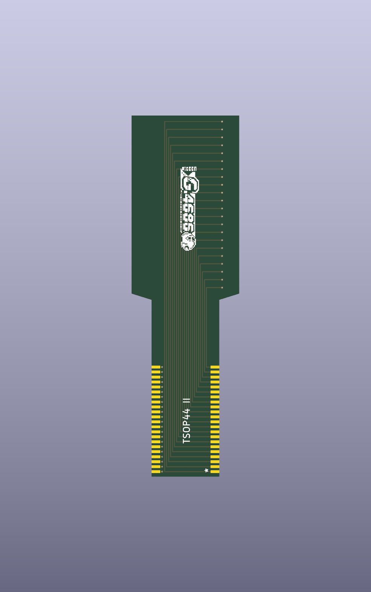

# WonderSwan SOP-44 to TSOP II-44 FPCB adapter



Final KiCad 9 project for a passive 44-pin flexible adapter intended for a WonderSwan cartridge.

## Validation status

- ERC: 0 violations.
- DRC: 0 violations.
- Unconnected items: 0.
- Schematic/PCB parity problems: 0.
- Structural validation: 32/32 checks passed.

## Design summary

| Parameter | Final value |
|---|---:|
| Flat dimensions | 17.30 x 58.00 mm |
| Hinge | 10.00 x 10.90 mm |
| Connectivity | 44 direct nets, `J1.N -> J2.N` |
| J1 | SOP-44, vertical, B.Cu, 90 degrees |
| J2 | TSOP II-44 edge pads, vertical, F.Cu, 180 degrees |
| J2 pad geometry | 1.40 x 0.45 mm, 0.80 mm pitch |
| Hinge routing | 22 tracks F.Cu + 22 tracks B.Cu, 0.15 mm |
| Vias | 44 total, none in hinge |
| Nominal FPCB thickness | 0.099 mm |
| Surface finish | ENIG |

J2 pin 1 points toward the outer end. Its flat copper contacts intentionally reach the PCB edge and are governed by the custom `.kicad_dru` rule.

## Repository structure

```text
hardware/kicad/          Editable KiCad project and local libraries
hardware/manufacturing/  Gerbers, drill files, IPC-2581 and fabrication notes
docs/                    Schematics, 1:1 drawings, validation report and provenance
assets/                  SVG and top/bottom 3D renders
validation/              ERC, DRC and structural reports
scripts/                 Reproducible validation and export tools
.github/workflows/       GitHub Actions validation
```

## Reproduce validation

Requires KiCad 9 and Python 3:

```bash
bash scripts/validate.sh
```

## Regenerate manufacturing outputs

```bash
bash scripts/export_fabrication.sh
```

To regenerate the illustrated validation report and the verified 1:1 mechanical template, install ReportLab and run:

```bash
python3 scripts/generate_documents.py
```

## Before fabrication

Print `docs/mechanical_template_verified_1to1.pdf` at 100 percent, with page scaling disabled, and measure both the 50 mm calibration bar and the documented 17.30 x 58.00 mm envelope. Confirm the physical SOP pin numbering, J2 alignment, cartridge clearance, FPCB stackup, ENIG edge-contact process, and static bend radius with the manufacturer.

This is a validated prototype design, not a substitute for manufacturer DFM approval or physical fit testing.

## License

No public license has been selected. Add an appropriate hardware license before publishing the repository publicly.
